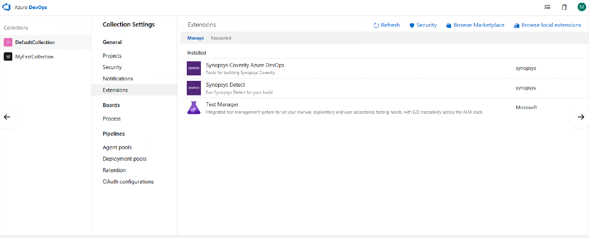

## Overview ##

The [Synopsys Detect](https://synopsys.atlassian.net/wiki/spaces/INTDOCS/pages/62423113/Synopsys+Detect) plugin for Azure DevOps (formerly known as Hub Detect) supports Software Composition Analysis (SCA: open source software detection). It is architected to seamlessly integrate Synopsys Detect with Azure DevOps build and release pipelines. Synopsys Detect makes it easier to set up and scan code bases using a variety of languages and package managers across different application security techniques.  

As a Synopsys and Azure DevOps user, Synopsys Detect Extension for Azure DevOps enables you to:

•	Run a component scan in an Azure DevOps job:

•	Create projects and releases in Black Duck through the Azure DevOps job.
	
•	After a scan is complete, the results are available on the Black Duck server (for SCA)

## Key Features ## 

Open Source Discovery: Rapid scanning and identification of open source libraries, versions, license, and community activity powered by the Black Duck® KnowledgeBase™.

## The Extension ##

Detect for Azure DevOps is architected to integrate seamlessly with build and release pipelines for Black Duck

## Documentation ##

Instructions and examples are available on our [Public Confluence](https://synopsys.atlassian.net/wiki/spaces/INTDOCS/pages/622618/Synopsys+Detect+for+Azure+DevOps)

For information on the full capabilities of Detect visit [Detect Public Confluence](https://synopsys.atlassian.net/wiki/spaces/INTDOCS/pages/62423113/Synopsys+Detect)

## Pre-Requisites ##

Before calling Detect in Azure DevOps, an active instance of Black Duck is required.

If you do not have Black Duck, refer to [Azure Marketplace](https://azuremarketplace.microsoft.com/en-us/marketplace/apps/black-duck-software.blackduck_hub_431) for more information.

## Want to contribute? ##

Running into an issue? Want to contribute? All code for this extension is [available on Github](https://github.com/blackducksoftware/detect-for-tfs).  
