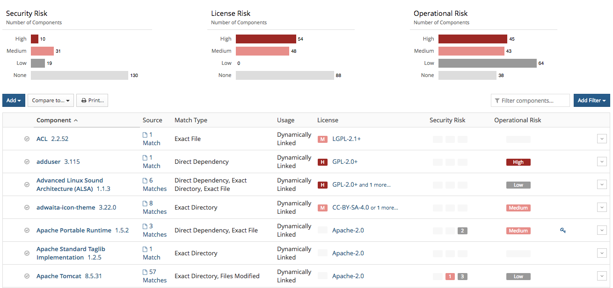
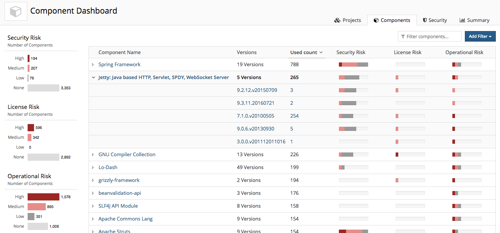
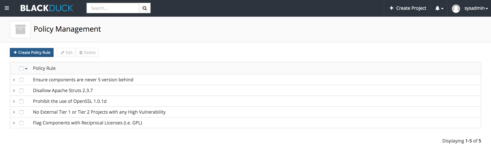
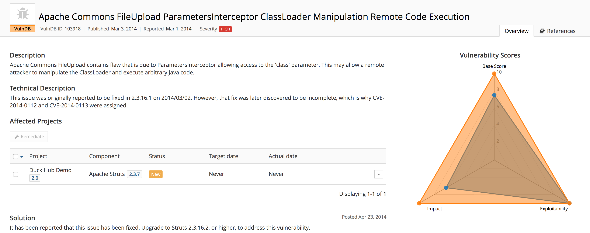
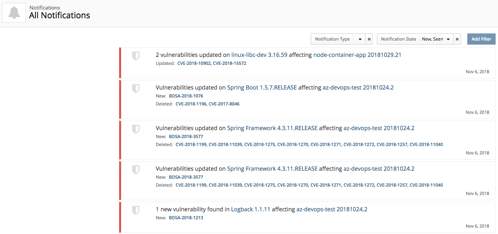
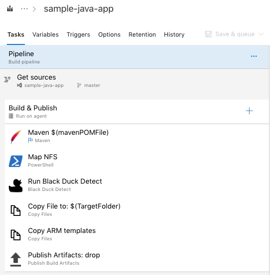

## Overview ##

The Black Duck plugin for TFS and Azure DevOps allows automatic detection of open source security vulnerabilities during your application build process. The integration allows you to enforce policies configured in Black Duck to receive alerts and fail builds when policy violations are met. 

## What is Black Duck? ##

[Black Duck by Synopsys](https://www.blackducksoftware.com/) helps organizations identify and mitigate open source security, license compliance and code-quality risks across application and container portfolios. Black Duck is powered by the world’s largest open source KnowledgeBase™, with information on 2 million open source projects and 79,000+ known security vulnerabilities. The KnowledgeBase™, combined with the broadest support for platforms, languages and integrations, is why 2,000 organizations worldwide rely on Black Duck to secure and manage open source.

## Key Features ## 

Open Source Discovery: Rapid scanning and identification of open source libraries, versions, license, and community activity powered by the Black Duck® KnowledgeBase™ – the industry’s most complete with detailed data on more than 2 million open source projects and 79,000+ known open source vulnerabilities.

Identify Open Source Risk: Create an inventory of all open source components in use and map them to known security vulnerabilities, giving you insight to the severity of the vulnerability.

Policy Enforcement:  Leverage policy management to secure your code and manage your external and internal compliance mandates.

Risk Remediation: Make data-driven decisions around vulnerability remediation prioritization. See CVSS 2.0/3.0 scores as well as our own BDSA assessments and remediation guidance to quickly bring your projects back to compliance.

Continuous Monitoring for New Security Vulnerabilities: Continously monitor and alert on newly reported open source security vulnerabilities, without having to re-scan your code.

## The Extension ##

Black Duck for TFS and Azure DevOps is architected to integrate seamlessly with TFS and Azure DevOps build and release pipelines. 

Using other tools in your CI/CD pipeline such as Jenkins, Artifactory, and others? We have easy to use plugins for the most popular development tools, and REST APIs that allow you to build your own integrations for virtually any commercial or custom development environment. Check out our [Integrations page](https://synopsys.atlassian.net/wiki/spaces/INTDOCS/overview) for more information! 

## Documentation ##

Instructions and examples for the TFS/Azure DevOps Extension are available on our [Public Confluence](https://synopsys.atlassian.net/wiki/spaces/INTDOCS/pages/622655/Running+Hub+Detect+with+TFS+or+Azure+DevOps)

For information on the full capabilities of Detect visit [Black Duck Detect Docs](https://synopsys.atlassian.net/wiki/spaces/INTDOCS/pages/622633/Hub+Detect)

## Pre-Requisites ##

Before calling Detect in TFS/Azure DevOps, an active instance of Black Duck is required.

If you do not have Black Duck, refer to [Black Duck on the Azure Marketplace](https://azuremarketplace.microsoft.com/en-us/marketplace/apps/black-duck-software.blackduck_hub_431) for more information.

Follow the steps to [Deploy Black Duck on Azure](https://synopsys.atlassian.net/wiki/spaces/PARTNERS/pages/7471182/Installing+Black+Duck+in+Azure+Using+the+Azure+Marketplace) for more information on deploying from the Azure Marketplace.

## Want to contribute? ##

Running into an issue? Want to contribute? All code for this extension is [available on Github](https://github.com/blackducksoftware/detect-for-tfs).  