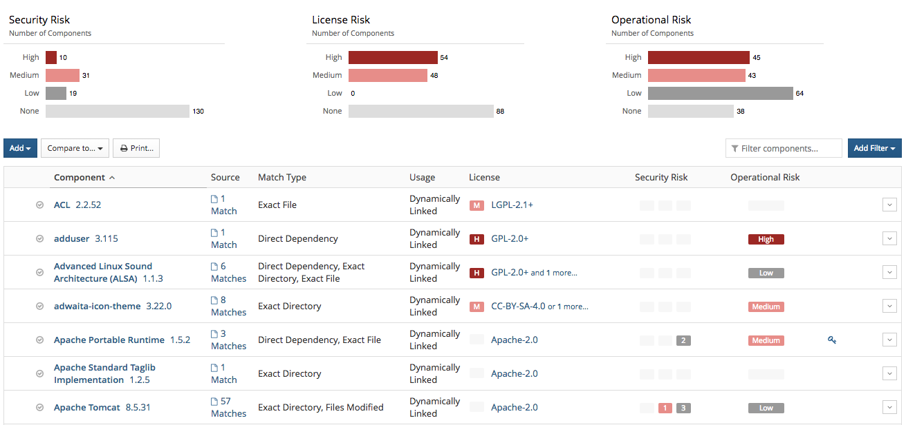
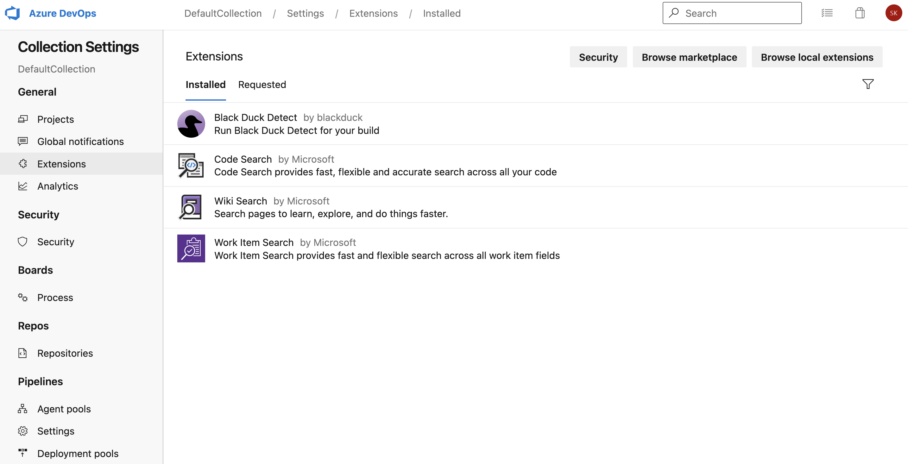

## Overview ##

The [Black Duck Detect](https://docs.blackduck.com/r/detect/latest/black-duck-detect/detect-azure-devops-ado-plugin.html) plugin for Azure DevOps supports Software Composition Analysis (SCA: open source software detection). It is architected to seamlessly integrate Black Duck Detect with Azure DevOps build and release pipelines. Black Duck Detect makes it easy to set up and scan code bases using a variety of languages and package managers across different application security techniques.  

As a Black Duck SCA and Azure DevOps user, Black Duck Detect Extension for Azure DevOps enables you to:

•	Run a component scan in an Azure DevOps job.

•	Create projects and releases in Black Duck through the Azure DevOps job.
	
•	After a scan is complete, the results are available on the Black Duck SCA server.

## Key Features ## 

Open Source Discovery: Rapid scanning and identification of open source libraries, versions, license, and community activity powered by the Black Duck® KnowledgeBase™.

## The Extension ##

Detect for Azure DevOps is architected to integrate seamlessly with build and release pipelines for Black Duck® SCA.

## Documentation ##

Instructions and examples for the Azure Plugin are available on our [Documentation Portal - Detect Azure Plugin](https://docs.blackduck.com/r/detect/latest/black-duck-detect/detect-azure-devops-ado-plugin.html)

For information on the full capabilities of Detect visit our [Documentation Portal](https://docs.blackduck.com/r/detect/latest/black-duck-detect/introduction-to-black-duck-detect.html)

## Pre-Requisites ##

Before calling Detect in Azure DevOps, an active instance of Black Duck SCA is required.

If you do not have Black Duck SCA, [Contact Black Duck Sales](https://www.blackduck.com/contact-sales.html) for more information.

## Want to contribute? ##

Want to contribute to this project? All code for this extension is [available on Github](https://github.com/blackducksoftware/detect-ado).  
