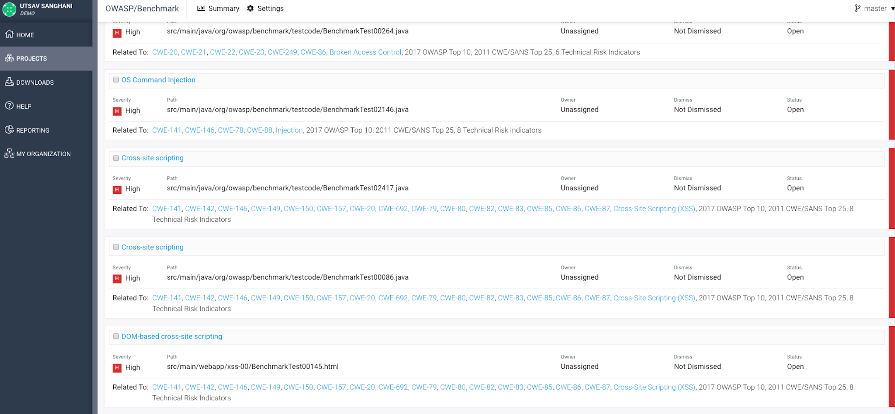

## Overview ##

The [Synopsys Detect](https://synopsys.atlassian.net/wiki/spaces/INTDOCS/pages/62423113/Synopsys+Detect) plugin for Azure DevOps (formerly known as Hub Detect) consolidates the functionality of Black Duck™ and Coverity™ on Polaris™ to support Software Composition Analysis (SCA: open source software detection) and Static Application Security Testing (SAST: code analysis). It is architected to seamlessly integrate Synopsys Detect with Azure DevOps build and release pipelines. Synopsys Detect makes it easier to set up and scan code bases using a variety of languages and package managers across different application security techniques.  

As a Synopsys and Azure DevOps user, Synopsys Detect Extension for Azure DevOps enables you to:

•	Run a component scan in an Azure DevOps job:

•	Create projects and releases in Black Duck through the Azure DevOps job.
	
•	After a scan is complete, the results are available on the Black Duck server (for SCA)

•	After the scan is complete, the results are available on the Coverity on Polaris server (for SAST)

## Key Features ## 

Defect Discovery with Coverity Static Analysis: Identify security & quality defects in your proprietary application using Coverity's market-leading Static Analysis solution. Synopsys Detect only supports Coverity on Polaris. 

Open Source Discovery: Rapid scanning and identification of open source libraries, versions, license, and community activity powered by the Black Duck® KnowledgeBase™.

## The Extension ##

Detect for Azure DevOps is architected to integrate seamlessly with build and release pipelines for both Black Duck and Coverity on Polaris 

Using other tools in your CI/CD pipeline such as Jenkins, Artifactory, and others? We have easy to use plugins for the most popular development tools, and REST APIs that allow you to build your own integrations for virtually any commercial or custom development environment. Check out our [Integrations page](https://synopsys.atlassian.net/wiki/spaces/INTDOCS/overview) for more information! 

## Documentation ##

Instructions and examples are available on our [Public Confluence](https://synopsys.atlassian.net/wiki/spaces/INTDOCS/pages/622618/Synopsys+Detect+Extension+for+VSTS)

For information on the full capabilities of Detect visit [Detect Public Confluence](https://synopsys.atlassian.net/wiki/spaces/INTDOCS/pages/62423113/Synopsys+Detect)

## Pre-Requisites ##

Before calling Detect in TFS or Azure DevOps, an active instance of Black Duck and/or Polaris is required.

If you do not have Black Duck, refer to [Azure Marketplace](https://azuremarketplace.microsoft.com/en-us/marketplace/apps/black-duck-software.blackduck_hub_431) for more information.

Follow the steps to [Deploy on Azure](https://synopsys.atlassian.net/wiki/spaces/PARTNERS/pages/7471182/Installing+Black+Duck+in+Azure+Using+the+Azure+Marketplace) for more information on deploying from the Azure Marketplace.

If you do not have Coverity on Polaris, contact us at sig-info@synopsys.com

## Want to contribute? ##

Running into an issue? Want to contribute? All code for this extension is [available on Github](https://github.com/blackducksoftware/detect-for-tfs).  
