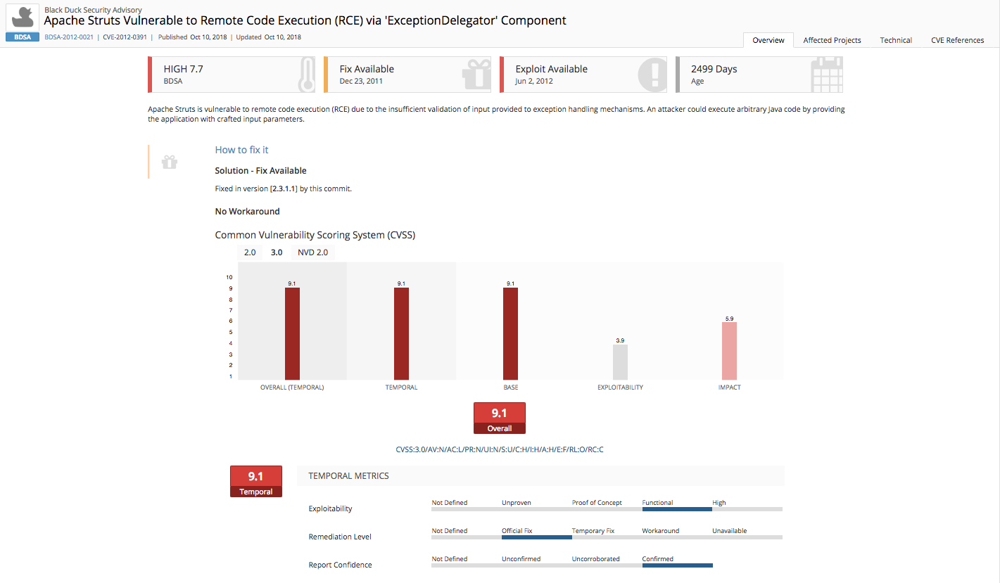

## Overview

Black Duck Detect and its plugin for Team Foundation Server (TFS) allows you to automatically find and fix open source security vulnerabilities during the build process, so you can proactively manage risk. The integration allows you to receive alerts and fail builds when any Black Duck Hub policy violations are met.  

## Organizations Trust Black Duck to Secure and Manage Open Source

[Black Duck](https://www.blackducksoftware.com/) helps organizations identify and mitigate open source security, license compliance and code-quality risks across application and container portfolios. Its flagship solution – Black Duck Hub – is powered by the world’s largest open source KnowledgeBase™, with information on 2 million open source projects and 79,000+ known security vulnerabilities. The KnowledgeBase™, combined with the broadest support for platforms, languages and integrations, is why 2,000 organizations worldwide rely on Black Duck to secure and manage open source.

Black Duck Hub is architected to address the challenges facing developers by integrating seamlessly with your continuous integration and development servers, build tools, containers and repositories. With easy to use [plugins]( https://www.blackducksoftware.com/technology/integrations) for the most popular development tools, and REST APIs that allow you to build your own integrations for virtually any commercial or custom development environment, you can be agile, secure, and compliant.

## Key Features: 

•	Rapid Discovery of Open Source: Rapid scanning and identification of open source libraries, versions, license, and community activity using the Black Duck® KnowledgeBase™ – the industry’s most complete with detailed data on more than 2 million open source projects and 79,000+ known open source vulnerabilities. 

•	Identify Open Source Risks: Create an inventory of all open source in use and map to known security vulnerabilities, identifying and prioritizing the severity of the vulnerability and explore remediation steps. 

•	Remediation and Policy Enforcement: Open source vulnerability remediation prioritization, mitigation guidance, and automated policy management allowing organizations to gain visibility to their remediation efforts and manage their external and internal compliance mandates. 

•	Continuous Monitoring for New Security Vulnerabilities: Ongoing monitoring and alerting on newly reported open source security vulnerabilities. 

## Find and Fix Open Source Security, License and Operational Risk

Black Duck Hub uses advanced techniques to build and maintain a catalog of your open source, assessing the security, license, and operational risk.

## Ensure Safe and Effective Components

Policies and rules can be set up to ensure organizations are using healthy open source. The ability to fail the build based on any policy violations is supported.

## Enhanced Security Vulnerability Information

Track what projects contain known open source vulnerabilities, and quickly remediate with recommended solutions. 

Black Duck® KnowledgeBase™ (KB) is the world’s largest knowledge base of open source components and their risks. For component discovery and analysis, it crawls, indexes, and analyzes 8,500+ sources for open source projects and components.  The KB is updated “real-time” with open source project and component updates.  For security analysis, Black Duck has Enhanced Vulnerability Data using multiple sources including VulnDB, NVD and our own security intelligence team focused on making risk data actionable.  This provides you with additional intelligence to aid in risk rating/prioritization as well as actionable guidance for vulnerability remediation/mitigation.

## Black Duck Risk Report

View your scanned project's bill of materials (BOM), along with the associated security risk and policy violations directly from the build output.

## Documentation

All documentation can be found at the base project: https://github.com/blackducksoftware/hub-tfs/wiki

